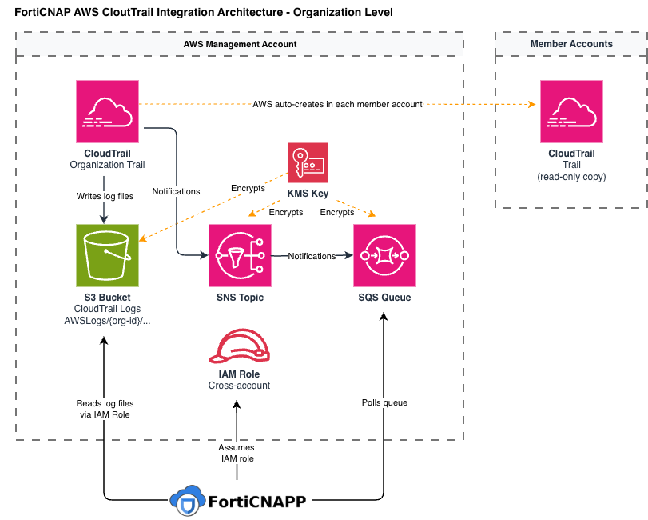

# Lacework AWS CloudTrail Integration - Organization-Level

## Overview

This integration enables Lacework to consume AWS CloudTrail events from all accounts in your AWS Organization to detect threats, suspicious API activity, and policy violations in near-real-time.

The key advantage of the organization-level setup is simplicity: AWS Organizations supports **organization trails** — a single trail deployed in the management account that automatically captures API activity across every current and future member account. No per-account CloudTrail configuration is needed.

Unlike the AWS Config integration — which continuously assesses resource *configurations* for compliance — the CloudTrail integration is **event-driven**: Lacework processes a stream of API call logs as they occur and alerts on suspicious activity patterns as they happen.

---

## Architecture

The entire integration lives in the **AWS Organizations management account**. A single organization trail captures events from all member accounts; everything else (S3 bucket, SNS topic, SQS queue, IAM role) is also in the same account. Lacework accesses everything through one set of credentials.



---

## How the Integration Is Established

The module is applied once in the management account with `is_organization_trail = true`. The following resources are created in sequence:

**1. S3 Bucket**
Stores all CloudTrail log files. Versioning is enabled, public access is blocked, and the bucket is KMS-encrypted. The bucket policy includes a statement allowing `cloudtrail.amazonaws.com` to write to `AWSLogs/{org-id}/*` — the organization ID prefix covers log files from every member account, not just the management account.

**2. KMS Key**
Encrypts the S3 bucket, SNS topic, and SQS queue. The key policy grants the CloudTrail and SNS services the ability to generate and use data keys for encryption.

**3. Organization Trail**
A single CloudTrail trail created with `is_organization_trail = true`. AWS Organizations automatically extends its scope to capture API activity across every current and future member account. Notably, [AWS automatically creates a read-only copy of this trail in each member account](https://docs.aws.amazon.com/awscloudtrail/latest/userguide/creating-trail-organization.html) — member account users can see the trail but cannot modify or delete it. Nothing needs to be deployed in member accounts.

**4. SNS Topic**
CloudTrail publishes a delivery notification here each time it writes a new log file to S3. The topic policy allows the CloudTrail service to publish notifications from the org trail.

**5. SQS Queue**
Subscribes to the SNS topic. Lacework polls this queue to discover when new log files are available. Messages are encrypted with KMS and deleted by Lacework after successful processing.

**6. IAM Role**
A cross-account role in the management account trusted by Lacework's platform AWS account (`434813966438`), protected by a unique External ID. The attached policy grants Lacework exactly the permissions needed to consume events — read S3, poll SQS, and decrypt with KMS.

**7. Lacework Integration Registered**
The Lacework Terraform provider registers the integration directly via the Lacework API, passing the SQS queue URL and IAM role ARN. No Lambda functions or CloudFormation custom resources are involved. From this point Lacework begins receiving events from every account in the organization.

---

## How CloudTrail Events Reach Lacework

1. An API call occurs in any account in the organization (management or member).
2. The organization trail captures the event and periodically writes a compressed log file to the S3 bucket under `AWSLogs/{org-id}/{member-account-id}/...`.
3. CloudTrail publishes a delivery notification to the SNS topic indicating the new log file's S3 location.
4. The SNS topic delivers the notification to the SQS queue.
5. Lacework polls the SQS queue, reads the S3 object key from the message, fetches the log file from S3, and processes the events.
6. Lacework deletes the SQS message after successful processing.

---

## How Lacework Accesses Your Logs

### The IAM Role

The IAM role in the management account has a trust policy allowing Lacework's platform AWS account (`434813966438`) to assume it. An **External ID** — generated by the module and unique to your deployment — must be presented in every assume-role call. This prevents [confused-deputy attacks](https://docs.aws.amazon.com/IAM/latest/UserGuide/confused-deputy.html).

### Permissions Granted

| Permission | Resource | Purpose |
|---|---|---|
| `s3:GetObject` | CloudTrail bucket | Read log files |
| `s3:ListBucket` (prefix: `AWSLogs/`) | CloudTrail bucket | Enumerate log files |
| `sqs:ReceiveMessage`, `sqs:DeleteMessage`, `sqs:GetQueueAttributes`, `sqs:GetQueueUrl` | SQS queue | Consume and acknowledge event notifications |
| `kms:Decrypt` | KMS key | Decrypt encrypted log files and queue messages |
| `cloudtrail:DescribeTrails`, `cloudtrail:GetTrailStatus` | All trails | Diagnostic / health check |
| `sns:GetTopicAttributes`, `s3:GetBucketPolicy`, `s3:GetBucketLocation` | SNS topic, S3 bucket | Diagnostic / health check |

No write, delete, or administrative permissions are granted. Lacework cannot modify your logs, trails, or any other AWS resource.

---

## New Member Accounts — Zero Additional Setup

Because the trail is an organization trail, any account that joins your AWS Organization is **automatically covered** — there is nothing to deploy, configure, or approve in the new account. Lacework will begin receiving events from it immediately.

This is in contrast to the `consolidated_trail` pattern, where a separate `aws_cloudtrail` resource would need to be deployed in each member account pointing to the central S3 bucket.

---

## Multi-Tenant Routing (Optional)

For organizations using Lacework Organizations (multiple Lacework accounts), the `org_account_mappings` variable routes CloudTrail events from specific AWS accounts to specific Lacework sub-accounts:

```hcl
module "cloudtrail" {
  source                = "lacework/cloudtrail/aws"
  is_organization_trail = true

  org_account_mappings = [{
    default_lacework_account = "my-lacework-account"
    mapping = [
      {
        lacework_account = "team-a"
        aws_accounts     = ["111111111111", "222222222222"]
      },
      {
        lacework_account = "team-b"
        aws_accounts     = ["333333333333"]
      }
    ]
  }]
}
```

Events from the listed AWS accounts are routed to their mapped Lacework sub-account. All other accounts fall back to `default_lacework_account`. This is useful when different business units own separate Lacework tenants within a shared AWS Organization.

---

## Security Design

**Least-privilege IAM**
Lacework's cross-account role is read-only on S3 and consume-only on SQS. It cannot write, modify, or delete log files, trails, or any other resource.

**External ID protection**
The External ID is unique to your deployment. Lacework must present it when assuming the role — preventing a third party from tricking Lacework into accessing your account.

**KMS encryption end-to-end**
The S3 bucket, SNS messages, and SQS messages are all encrypted with the same KMS key. Lacework is granted only `kms:Decrypt` — it cannot manage, rotate, or disable the key.

**Org-scoped S3 write policy**
The bucket policy allows CloudTrail to write to `AWSLogs/{org-id}/*`, scoped to your specific AWS Organization ID — not a wildcard across all AWS accounts globally.

---

## Troubleshooting

**No events appearing in Lacework after applying**
Verify the trail was created with `is_organization_trail = true`. A standard (non-org) trail will not capture member account events. Check that the SNS-to-SQS subscription is in `Confirmed` state (not `PendingConfirmation`).

**No events from a specific member account**
Confirm the management account has `organizations:DescribeOrganization` permission — the module fetches the org ID to scope the S3 bucket policy. If the org trail was applied without this permission, the `AWSLogs/{org-id}/*` policy statement may be missing, preventing CloudTrail from writing member account logs.

**S3 write denied for member account logs**
Confirm `is_organization_trail = true` was set when applying. Without it, the module creates a standard single-account trail and the S3 bucket policy only covers `AWSLogs/{management-account-id}/*`.

**Lacework SQS receive errors or KMS decryption failures**
Verify the KMS key policy grants `kms:Decrypt` to the Lacework IAM role ARN. Also verify the SQS queue policy allows the SNS topic to send messages.

**External ID mismatch on assume-role**
The External ID is generated once at `terraform apply` time and stored in Terraform state. If the IAM role or Lacework integration resource was destroyed and re-created, a new External ID was generated — re-apply to sync the new value into the Lacework integration.
